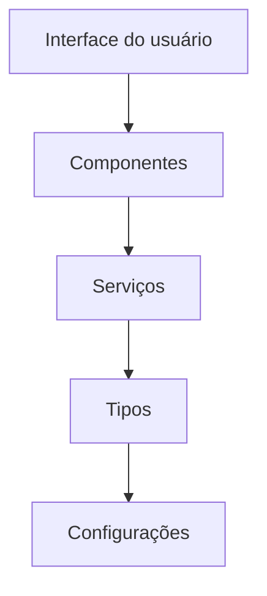

# 🎬 Lux - Anime Collection App

<div align="center">


[](https://reactnative.dev/)
[](https://expo.dev/)
[](https://www.typescriptlang.org/)

</div>

## 📱 Sobre o Projeto

Lux é um aplicativo mobile moderno para colecionadores de animes, desenvolvido com React Native e Expo.

### ✨ Funcionalidades Principais

- 🎯 Descobrir novos animes através da API MyAnimeList
- ➕ Adicionar animes à sua coleção pessoal
- 🔍 Explorar informações detalhadas sobre animes

## 🛠️ Tecnologias Utilizadas

- [React Native](https://reactnative.dev/) - Framework mobile
- [Expo Router](https://docs.expo.dev/router/introduction/) - Sistema de navegação
- [React Native Paper](https://callstack.github.io/react-native-paper/) - UI Components
- [TypeScript](https://www.typescriptlang.org/) - Tipagem estática

## 📁 Estrutura Detalhada do Projeto

### 📂 `app/`
> Pasta principal do aplicativo que contém todas as telas e rotas.

#### 📂 `(tabs)/`
> Rotas principais organizadas em abas de navegação:

| Arquivo | Descrição |
|---------|-----------|
| `index.tsx` | Tela inicial com animes populares e em destaque |
| `add.tsx` | Tela para adicionar novos animes à coleção |
| `my-animes.tsx` | Tela para gerenciar a coleção pessoal |

#### 📄 `_layout.tsx`
> Define o layout base do aplicativo:
- ⚙️ Configuração da navegação
- 🎨 Tema global
- 📱 Estrutura de abas

### 📂 `components/`
> Componentes React reutilizáveis:
- 🎴 Cards de anime
- 🪟 Modais
- 🔘 Botões personalizados
- 🎯 Elementos de UI compartilhados

### 📂 `constants/`
> Arquivos de configuração e constantes:

#### 📄 `theme.ts`
> Define:
- 🎨 Cores do aplicativo
- 📏 Espaçamentos
- 📝 Tipografia
- 🎯 Estilos globais
- 📐 Tamanhos de componentes

### 📂 `services/`
> Serviços para integração com APIs e gerenciamento de dados:

#### 📄 `animeService.ts`
> Gerencia:
- 🔍 Busca de animes na API MyAnimeList
- 📝 Operações CRUD na coleção
- 💾 Gerenciamento de dados locais
- 🔄 Integração com backend

### 📂 `types/`
> Definições de tipos TypeScript:

#### 📄 `anime.ts`
> Interfaces para:
- 📋 Dados de anime
- 🔍 Resultados de busca
- 📡 Respostas da API
- 📊 Estruturas de dados

### 📂 `assets/`
> Recursos estáticos:
- 🖼️ Imagens
- 🎯 Ícones
- 📝 Fontes
- 🎨 Recursos visuais

## 🚀 Como Começar

### Pré-requisitos
- Node.js
- npm ou yarn
- Expo CLI

### Instalação

```bash
# Clone o repositório
git clone https://github.com/seu-usuario/lux-anime-app.git

# Entre na pasta do projeto
cd lux-anime-app

# Instale as dependências
npm install

# Inicie o app
npx expo start
```

## 💻 Desenvolvimento

### 🔄 Fluxo de Dados


### 🎨 Estilização
- 🎯 Utiliza React Native Paper para componentes base
- 🎨 Tema personalizado definido em `constants/theme.ts`
- 📱 Estilos específicos em cada componente
- 📐 Design responsivo e adaptativo

## 📱 Screenshots

<div align="center">
  
  
  
</div>

## 🤝 Contribuindo

1. Faça um Fork do projeto
2. Crie uma Branch para sua Feature (`git checkout -b feature/AmazingFeature`)
3. Commit suas mudanças (`git commit -m 'Add some AmazingFeature'`)
4. Push para a Branch (`git push origin feature/AmazingFeature`)
5. Abra um Pull Request

## 📝 Licença

Este projeto está sob a licença MIT. Veja o arquivo [LICENSE](LICENSE) para mais detalhes.

---

<div align="center">
  <sub>Desenvolvido com ❤️ pela equipe Lux</sub>
</div>
